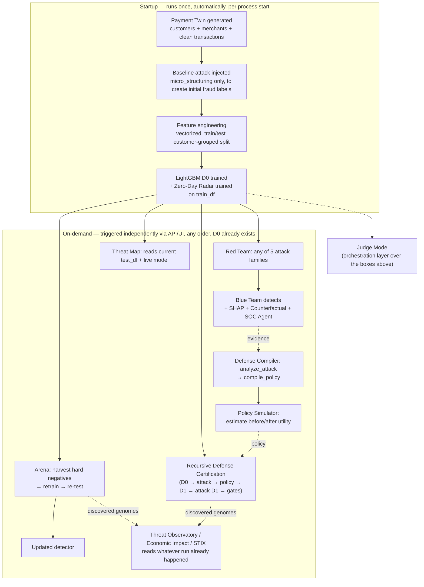
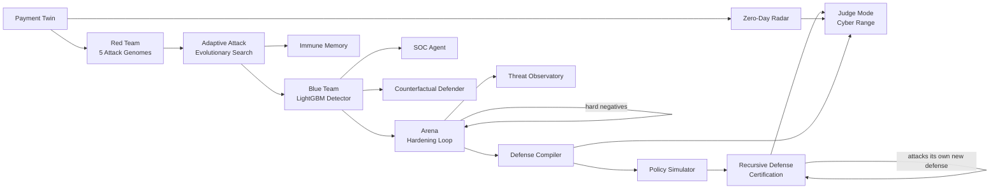
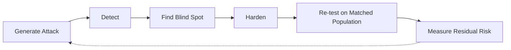
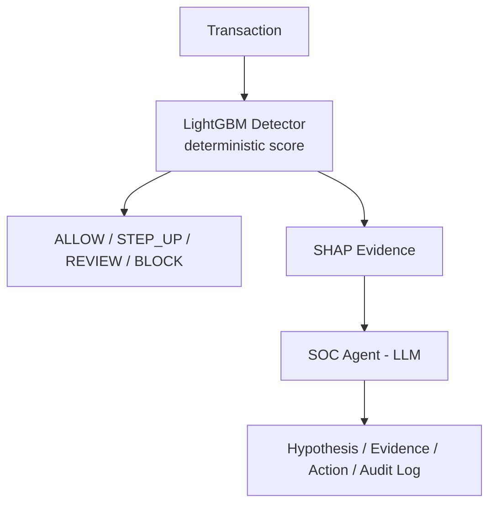
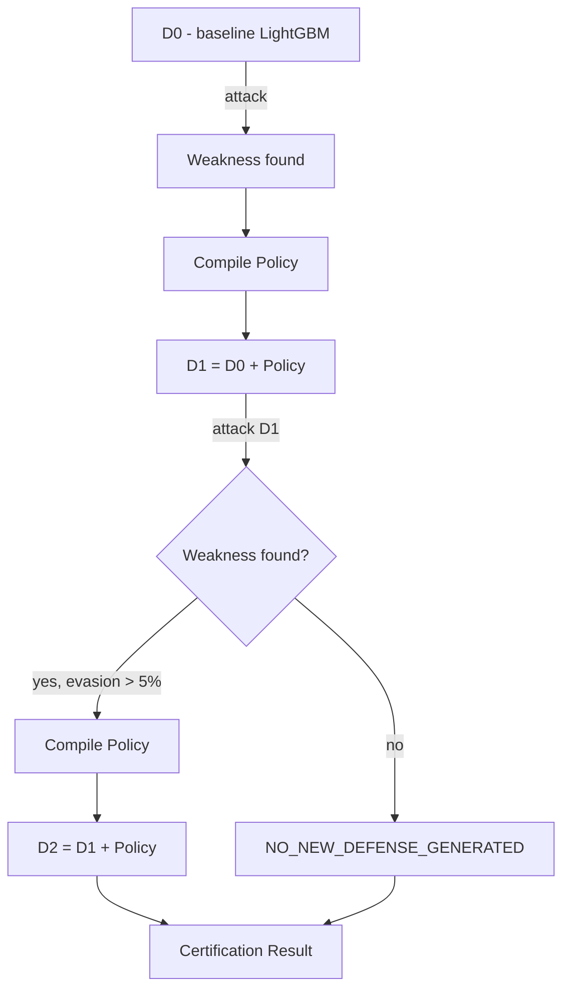

# SENTINEL-X
### Autonomous Adversarial Payment Defense

Sentinel-X continuously attacks its own payment defense, finds the blind
spots, hardens the defense, and then **attacks the new defense again** —
measuring, at every step, exactly how much residual risk is left. It is not
a static rules engine or a one-shot trained classifier: it is a closed loop
of attack, detection, root-cause analysis, hardening, and re-attack, and
every number in this document comes from a real, reproducible computation
over a synthetic dataset — never a fabricated demo value.

**90.6% F1 · 86.7% Precision · 94.8% Recall · 1.71% FPR · 181 automated tests**
*(measured live — see [§16 Verified Results](#16-verified-results) and
[§21 Reproducing the Results](#21-reproducing-the-results))*

| | |
|---|---|
| **Backend** | FastAPI (Python 3.11+), Pydantic v2 |
| **ML** | LightGBM + scikit-learn, SHAP (`TreeExplainer`), NetworkX |
| **Frontend** | Next.js (App Router) + TypeScript + Tailwind + shadcn/ui + React Three Fiber |
| **LLM (structured-output only)** | Groq (`openai/gpt-oss-120b`) — never scores a transaction |
| **Tests** | 181 automated tests, `pytest` |
| **Data** | 100% synthetic — zero real cardholder or production payment data |

---

## Why Sentinel-X

Traditional fraud detection is a single arrow:

```
ATTACK  →  DETECT
```

A model is trained once, deployed, and left to degrade as attackers adapt
around it. Sentinel-X closes the loop instead:

```
ATTACK → DETECT → ANALYZE → HARDEN → RE-ATTACK → MEASURE RESIDUAL RISK
                                          ↑                    |
                                          └────────────────────┘
```

The central engineering bet of this project is one sentence:

> **The defense is itself attacked.**

Every hardening step Sentinel-X produces — a retrained model, a compiled
defense policy, a new certified defense version — is not trusted on faith.
It is immediately targeted by the same evolutionary attack engine that found
the original weakness, and the system reports honestly whether the new
defense held, regressed, or produced no measurable improvement at all.

---

## 1. Problem Statement

Payment fraud is not static, and the attack families this project builds
are chosen specifically because a fixed rule or a frozen model handles each
of them badly:

- **Synthetic identities** and **behavioral camouflage** are built to look
  statistically normal until the moment of extraction — a fixed rule
  threshold either catches them by luck or never does.
- **Social engineering / APP fraud** (the real-world analogue used here is
  UPI Collect Request-style scams) produces a transaction that is
  *structurally* completely normal — the attack lives entirely in coercive
  metadata a naive amount/velocity model never sees.
- **Synthetic voice/video impersonation** targets the human
  step-up-authentication layer, not the model at all.
- A detector trained once and left alone degrades silently as real
  attackers (or, here, an evolutionary search) discover the specific blind
  spots of that one frozen decision boundary.

The response Sentinel-X proposes is **continuous adversarial validation**:
never trust a defense you haven't already tried to break yourself.

*(This section is qualitative framing, not a measured result. Every
specific number elsewhere in this document is a real, reproducible value
from this repository — see [§21](#21-reproducing-the-results).)*

---

## How Sentinel-X Runs

Two different questions look similar but aren't: **what order does the
system actually execute in**, and **what order should a judge click
through the demo in**. This section answers the first; [§3](#3-5-minute-walkthrough)
answers the second.



Three things this diagram is careful to get right:

- **Startup is a strict pipeline; everything after it is not.** Red Team,
  Arena, the Defense Compiler, Recursive Defense, and Threat Map are each
  independently callable once `D0` exists — none of them requires another
  one of them to have run first, and there is no single canonical order
  the application enforces.
- **Judge Mode is an orchestration layer, not a prerequisite stage.** It
  calls the same underlying service functions as the boxes above, in
  sequence, inside one API call ([§11](#11-judge-mode--the-fraud-cyber-range)).
  Running it is not a requirement for using Red Team, Arena, or Recursive
  Defense manually, and using those manually is not a requirement for
  running Judge Mode.
- **Threat Observatory and Threat Map are observability layers**, not
  processing stages — they read and present whatever Immune Memory / model
  state already exists rather than producing new attacks or defenses
  themselves.

### Recursive Certification lifecycle (summary)

```
D0 (baseline) → attack D0 → weakness found → compile DefensePolicy
   → D1 = D0 + policy → attack D1 → gates checked
   → CERTIFIED, or FAILED (regression/leakage), or NO_NEW_DEFENSE_GENERATED
```

`D1` exists only when a real `DefensePolicy` was actually compiled from a
meaningful (>5%) evasion; a second round attacks the *current* composite
defense, not a replay of round one. See
[§10](#10-recursive-defense-certification-engine) for the full diagram and
the exact gating logic — this summary exists only to place certification in
the overall execution order above, not to duplicate that section.

---

## 2. System Architecture



Every box above is a real, separately testable Python module in this
repository (see [§17 Repository Map](#17-repository-map)). Nothing in this
diagram is aspirational — anything not yet built is named explicitly in
[§20 Future Work](#20-future-work).

### Adversarial Loop (detail)



### Trust Boundary — LLM vs. Decision Engine



The LLM sits strictly downstream of the decision, consuming evidence and
producing narration — it never has a path back into `D`. See
[§13 Security & Threat Model](#13-security--threat-model).

---

## 3. 5-Minute Walkthrough

### Judge Demo Order

This order is chosen for narrative clarity, not because the system
requires it — see [How Sentinel-X Runs](#how-sentinel-x-runs) for what
actually depends on what. Judge Mode in particular is an orchestration
layer over the other screens, not a gate you must pass through first.

A suggested order for seeing the whole loop live, once both servers are
running ([§21](#21-reproducing-the-results)):

```
00:00  Command Center        — global KPIs, LIVE/SANDBOX status
00:30  Payment Twin          — the synthetic world: customers, transactions, behavior
01:00  Red Team Lab          — pick an attack family, run it against the live model
01:45  Blue Team SOC         — color-coded decision feed; click a BLOCK for SHAP + Counterfactual + SOC Agent
02:30  Arena                 — trigger hardening, watch evasion rate drop after retrain
03:15  Judge Mode            — run the full 11-phase PREPARE→SCORE pipeline in one command
                                (the Defense Compiler / Policy Simulator step shows up here,
                                 inside DEFEND/SIMULATE/APPROVE, and on the Command Center's
                                 policy widgets — there is no separate "Defense Compiler" screen)
04:00  Recursive Defense     — certify D0 → D1: attack the baseline, then attack the new defense
04:40  Threat Observatory    — Fraud DNA tree, Economic Impact, STIX export
04:55  Threat Map            — geographic snapshot of the same evaluation run
05:00  Takeaway              — most systems prove they can detect fraud;
                                Sentinel-X also tries to break the defense that detected it
```

All operational data displayed by the frontend is sourced from the backend
APIs; static UI labels and configuration constants (page titles, legends,
axis units) are not treated as benchmark results.

<!-- Add verified screenshot: Command Center -->
<!-- Add verified screenshot: Red Team Lab -->
<!-- Add verified screenshot: Payment Twin -->
<!-- Add verified screenshot: Blue Team SOC -->
<!-- Add verified screenshot: Adversarial Arena -->
<!-- Add verified screenshot: Judge Mode -->
<!-- Add verified screenshot: Recursive Defense -->
<!-- Add verified screenshot: Threat Observatory -->
<!-- Add verified screenshot: Threat Map -->

---

## 4. Synthetic Payment Twin

`backend/app/simulator/clean_generator.py`

A fully synthetic, reproducible payment ecosystem, generated with fixed
NumPy/Faker seeds so every run against the same dependency environment
produces deterministic data:

- **10,000 customers**, **500 merchants**, **50,000 transactions** over a
  30-day simulation window.
- Each customer has a persistent behavioral profile: income-tier-driven
  log-normal spend distribution, 1–2 primary devices, 3–10 usual merchants,
  2–6 usual beneficiaries, entity-persistence probability > 0.95 (a customer
  overwhelmingly keeps using the same devices/merchants/beneficiaries —
  novelty is the signal, not the norm).
- Diurnal timing (transactions cluster in daytime hours), realistic channel
  mix (POS/WEB/P2P), 10 merchant categories.
- **Fidelity-scored**, not asserted: `simulator/fidelity.py` computes a real
  KS-statistic / distribution-similarity report comparing generated data
  against the intended statistical targets, exposed via `POST /api/v1/simulate`.

All downstream generation (attacks, features, graph structure) sits on top
of this same synthetic twin — there is no real cardholder or production
payment data anywhere in this repository.

---

## 5. Feature Engineering & The LightGBM Detector

`backend/app/blue_team/features.py`, `graph_engine.py`, `detector.py`

Feature engineering is fully vectorized (no row-wise Python loops over a
DataFrame, by explicit project rule) and produces exactly 14 model inputs:

| Feature | What it captures |
|---|---|
| `amount` | Raw transaction amount |
| `count_5m` / `count_1h` / `count_24h` / `count_7d` | Rolling transaction-count velocity per customer |
| `sum_5m` / `sum_1h` / `sum_24h` / `sum_7d` | Rolling amount-sum velocity per customer |
| `amount_deviation_ratio` | `amount / (avg_amount_7d + 1e-6)` |
| `is_new_device` / `is_new_location` | Novelty flags against the customer's known profile |
| `shared_device_count` | Devices shared across distinct customers (train-graph) |
| `two_hop_fraud_risk` | Fraction of a customer's 2-hop network neighbors (shared device/beneficiary) with a fraud history in train |

Deliberately **excluded** from the model: `is_fraud` (target),
`genome_id`/`attack_family` (direct proxies for the label in this dataset),
raw merchant/channel identifiers (would let the model memorize a generation
artifact instead of learning behavioral signal), and
`is_new_beneficiary`/beneficiary-graph-degree (an explicit, documented
project decision — with only one un-mutated attack family available at
model-training time, routing to a brand-new mule beneficiary is a
near-deterministic tell that would erase the very evasion signal the Arena
is built to demonstrate).

**Detector**: `LightGBMClassifier` (`n_estimators=200`, `num_leaves=31`,
`learning_rate=0.05`, `is_unbalance=True`, `random_state=42`), trained on a
**customer-grouped, stratified train/test split** — every row for a given
customer goes entirely to one side, so the model can never see one
customer's behavior split across train and test. Graph features
(`shared_device_count`, `two_hop_fraud_risk`) are computed **train-only**
and then applied to both splits, so the graph itself cannot leak test
information into a feature.

**Decision thresholds** (single source of truth, not scattered magic
numbers):

```
[0.00, 0.35) → ALLOW
[0.35, 0.65) → STEP_UP
[0.65, 0.85) → REVIEW
[0.85, 1.00] → BLOCK
```

### Explainability

`backend/app/blue_team/explainability.py`

Two complementary explanation types, both scoped honestly to transactions
already present in the cached train/test set (SHAP needs the *exact*
engineered feature row, which cannot be recomputed from a bare
`transaction_id` — a transaction generated fresh elsewhere gets an honest
404, not a fabricated explanation):

- **SHAP reason codes** (`GET /explain/{transaction_id}`) — top-3
  `TreeExplainer` local attributions, in the exact `{feature, contribution,
  description}` shape.
- **Counterfactual Defender** (`GET /explain/counterfactual/{transaction_id}`)
  — answers "what is the smallest realistic change that would have flipped
  this to ALLOW?" It samples 1,000 nearby points around the transaction's
  real feature vector using **median-absolute-deviation-scaled** gaussian
  noise per feature (a raw standard deviation was tried first and produced
  nonsensical counterfactuals on heavy-tailed features like
  `amount_deviation_ratio` — MAD is robust to that), scores every sample
  with the real cached model, and reports the closest one that crosses the
  ALLOW threshold plus exactly which features would need to change and by
  how much. If none of the 1,000 samples cross ALLOW, it says so honestly
  (`"no_nearby_allow_found"`) rather than fabricating a result.

---

## 6. Red Team — Five Attack Families

`backend/app/red_team/attack_genomes.py`, `attack_injector.py`

Every attack is represented as a **structured, Pydantic-validated Attack
Genome** — a JSON object with a canonical `genome_id`, `family`,
`parameters`, and `mutations` list. This is the mechanism that makes the
whole adversarial loop tractable: attacks are data, not ad-hoc code paths.

| # | Family | Genome ID | What it does |
|---|---|---|---|
| 1 | Agentic Micro-Structuring | `ATK-MS-001` | Splits a large amount into 10–15 smaller transactions across mule accounts to stay under single-transaction and velocity thresholds |
| 2 | Synthetic Identity Drift | `ATK-ID-001` | Behaves normally for ~20 days to build trust, then executes a sudden high-velocity extraction via a new device and new payee |
| 3 | Behavioral Camouflage | `ATK-BC-001` | Interleaves fraudulent transactions inside an authentic-looking spending burst |
| 4 | Social Engineering / Semantic Coercion | `ATK-SC-001` | A structurally normal transaction with adversarial memo metadata (urgency, impersonation) — the UPI Collect Request scam pattern |
| 5 | Synthetic Voice/Video Authorization | `ATK-VD-001` | Metadata-only simulation of a phone call impersonating a bank agent/executive/family member to bypass step-up verification — **no real audio/video is ever generated** |

### Constraint-aware mutations

Every mutation applied to a genome (`arena.py`'s `MUTATION_REGISTRY`) is
validated before acceptance: the mutated amount must stay within
`[0, customer.mean_spend × 20]`, the mutated timestamp sequence must remain
chronologically ordered per customer, and novelty flags
(`is_new_device`/`is_new_beneficiary`) must stay internally consistent with
whatever the mutation actually changed. This is a real, citable
differentiator: naive perturbation-based attack generation produces
physically impossible transactions; a constraint-validated mutation stays
realizable.

### Adaptive Evolutionary Search

`backend/app/red_team/adaptive_attack.py`

A genuine genetic algorithm over genomes, not a fixed attack list:

- **Fitness** = `0.5 × evasion_rate + 0.2 × novelty_score + 0.2 ×
  normalized_impact + 0.1 × realism_score − validity_penalty`.
- Each generation mutates the elite genomes from the previous generation,
  scores every candidate against the **real cached model**, and tracks a
  full lineage: every genome, its `parent_attack_id`, generation number,
  `is_elite`/`is_best` flags, and validity status.
- Instance IDs and mutated parameters are drawn from a **seeded** random
  stream, so the entire evolutionary run — including exactly which mutated
  genome_id appears in which generation — is reproducible given the same
  seed and configuration.

---

## 7. Arena — The Adversarial Hardening Loop

`backend/app/red_team/arena.py`

The MVP-gate loop that proves hardening actually works, end to end:

1. Run the un-mutated genome against the current model on a held-out
   population → **Initial Evasion Rate**.
2. Run it again on a **disjoint training-customer population**, harvest the
   transactions the model missed as **hard negatives**.
3. Retrain the detector on the original training data **plus** those hard
   negatives.
4. Re-test on a **matched population** — the *same* customers as the
   initial measurement, with genuinely fresh attack instances (different
   amounts/timestamps/mule IDs, a disjoint `instance_id` namespace via
   `generate_matched_population_attacks`) — never the literal rows that fed
   retraining → **Final Evasion Rate**.

```
Adversarial Robustness Gain (%) = ((Initial Evasion Rate − Final Evasion Rate) / Initial Evasion Rate) × 100
```

A documented, load-bearing design correction lives in this file's own
docstring: an earlier version measured initial and final evasion on
*different* random customer populations, which confounded "did retraining
help" with "which random customers got drawn" (a genuine ~2.2%→4.1% swing
was observed from population variance alone). The matched-population design
above exists specifically to isolate the retraining effect from that
confound — this is exactly the kind of leakage/confound risk a system that
grades its own homework has to actively design against, not assume away.

`run_multi_family_hardening` extends this to all 5 families at once,
harvesting hard negatives from every family into a single combined retrain,
then reporting each family's evasion rate against that one hardened model
(exposed via `POST /api/v1/arena/multi-family-run`) — the closest thing in
this repository to a cross-family generalization measurement. A specific
numeric before/after table per family is **not currently published** in
this document; re-run the endpoint against your own clone to get one
(see [§21](#21-reproducing-the-results)).

---

## 8. Defense Compiler & Policy Simulator

`backend/app/blue_team/defense_compiler.py`, `policy_simulator.py`

Retraining is not the only defense mechanism. When the Arena or Judge Mode
finds a successful evasion, `analyze_attack` performs real root-cause
analysis (dominant SHAP-failure features, temporal/graph/novelty pattern
comparison between the base and evolved attack) and `compile_policy` turns
that into a structured `DefensePolicy` — an explicit, human-reviewable rule
(condition + action + severity), not another opaque model weight update.

`simulate_policy_utility` then estimates the policy's real effect: evasion
before/after, the honest FPR cost of adding the rule, and estimated fraud
loss prevented — computed from actual featured/graph-engineered clean and
attack populations and real `model.predict()` calls, not a hand-typed
number.

`CompositeDefenseAdapter` (`backend/app/defense/recursive_engine.py`) is the
piece that makes a compiled policy *and* the base model behave as one
composite defense for the purposes of the Arena/Recursive Defense loop: it
wraps M0 plus a list of accumulated `DefensePolicy` objects and exposes the
same `.predict()`/`.predict_proba()` interface the rest of the system
already expects — a genome doesn't need to know whether it's attacking a
raw model or a model-plus-policies stack.

### Why not just retrain?

| Traditional adversarial retraining | Sentinel-X |
|---|---|
| Attack → Retrain | Attack → Analyze → Compile Defense → Validate → Attack the new defense → Measure residual risk |
| Fix is buried in new model weights | Fix is an explicit, human-reviewable `DefensePolicy` |
| "It should be better now" | FPR/F1 regression gates must pass, or certification fails |
| One-shot | The new defense is itself re-attacked before being trusted |

---

## 9. Zero-Day Radar & Immune Memory

`backend/app/blue_team/zero_day.py`, `red_team/immune_memory.py`

**Zero-Day Radar** is an *unsupervised* companion to the supervised
detector: an Isolation-Forest-style novelty model trained on the real
held-out test set's engineered features, independent of the `is_fraud`
label. It clusters flagged "unknown" transactions and reports a real
novelty score and cluster count (`GET /defense/radar`) — this is the part
of the system that can, in principle, notice something the supervised
detector was never trained to recognize as fraud at all, since it isn't
looking for known fraud patterns in the first place.

**Immune Memory** is the system's accumulated record of every attack genome
discovered across every run this session — real `genome_id`, `attack_family`,
`initial_evasion`/`best_evasion`, `generation`, `parent_attack_id`,
`current_status` (`DISCOVERED`/`RETIRED`), and a `provenance` field that
explicitly distinguishes memory written during **training** hardening from
memory written during **evaluation-only** certification rounds — a
provenance boundary that exists specifically so evaluation-time discoveries
can never silently leak into what the model is retrained on. Exposed via
`GET /immune-memory` and visualized in the frontend's 3D "Payment Threat
Universe" (`components/three-d/ThreatUniverse.tsx`).

---

## 10. Recursive Defense Certification Engine

`backend/app/defense/recursive_engine.py`, `schemas.py`

This is the project's sharpest idea: **the defense becomes the next attack
target.**



Each round runs the real evolutionary search against the *current*
composite defense (`CompositeDefenseAdapter`), analyzes the failure,
compiles a policy if evasion is meaningful (>5%), and produces the next
defense version — genuinely recursive, not a fixed two-step demo.

**Data-integrity guarantees, enforced in code, not just asserted in
comments:**

- **Customer-level leakage** is checked with a hard `raise RuntimeError` if
  any customer appears in both the train and evaluation populations —
  certification cannot silently proceed past this.
- **Row-level leakage** — every attack transaction generated during
  certification is checked for `transaction_id` collisions against
  `train_df`/`test_df` and against every earlier round's evolved-attack
  batch, using `generate_matched_population_attacks`'s disjoint
  `instance_id` offset mechanism (the same one the Arena uses). This
  replaced an earlier version of the code where `row_leakage` was an
  unconditional literal `0` — a real, previously undetectable bug that
  building this real check surfaced and fixed.
- **F1/FPR regression gates** — the certification fails
  (`certification_status: "FAILED"`) rather than reporting success if the
  final F1 regresses by more than 2% or clean FPR increases by more than 1%
  versus the baseline, computed from real `evaluate_detector` calls on the
  original held-out test set.
- **`NO_NEW_DEFENSE_GENERATED`** is a real, honest terminal state — if the
  evolved attack's evasion doesn't clear the 5% bar, the engine reports
  exactly that instead of inventing a policy to fill the response shape.

### Failure is a first-class result

Sentinel-X is built to fail honestly rather than always report a win. Real
terminal/negative states that exist in the code today, not hypothetically:

- `certification_status: "FAILED"` — an F1 or FPR regression gate was
  actually tripped.
- `NO_NEW_DEFENSE_GENERATED` — the attacker couldn't find a meaningful new
  weakness in the current defense.
- `evasion_note` in Judge Mode's Scorecard — peak evolved evasion turned out
  indistinguishable from baseline (a "robust defense" finding).
- `"no_nearby_allow_found"` — the Counterfactual Defender found no sample
  within 1,000 draws that crossed ALLOW.
- `501` on `/defense/analyze-attack` for an unpersisted historical genome,
  rather than a fabricated analysis.

None of these are bugs; they are the system refusing to manufacture a
success it can't back with a real computation.

Exposed via `POST /api/v1/defense/certify`, visualized in the frontend by
`RecursiveDefenseGraph.tsx` — a real node-link diagram over the actual
`DefenseRound` sequence returned by the API, never a fabricated D2.

---

## 11. Judge Mode — The Fraud Cyber Range

`backend/app/judge/`, frontend `app/judge/page.tsx`

An 11-phase, single-command orchestration of nearly the entire system, built
specifically so a judge can watch the whole story unfold in one run:


Each phase calls existing, already-independently-tested service functions
(never reimplements them): attack injection, adaptive evolutionary search,
Zero-Day Radar, `analyze_attack`/`compile_policy`, `simulate_policy_utility`,
and an optional human-approval gate before the final replay/score. The
closing `Scorecard` reports initial/best-evolved/final evasion, robustness
gain, F1/FPR, unknown-detection rate and cluster count, policy status, and
an honest `evasion_note` when peak evolved evasion turns out to be
genuinely indistinguishable from the baseline.

---

## 12. Autonomous SOC Agent

`backend/app/blue_team/soc_agent.py`

A structured investigation layer built on the same architectural
non-negotiable as everywhere else in this project: **the LLM never scores a
transaction or makes the ALLOW/BLOCK decision.** It receives real SHAP
evidence for a real cached transaction plus a real Immune Memory summary,
and is forced (via Groq tool-calling, not free-form JSON — an earlier
`response_format=json_object` approach was tested and found to
occasionally collapse structured ranges into scalars) to return a
structured verdict: hypothesis, suspected attack family, confidence,
exactly 3 evidence points, recommended action, reasoning chain, and a
formal audit-log line. A malformed or invalid response gets exactly one
retry before the endpoint fails honestly — never a silently coerced
verdict. Exposed via `POST /api/v1/soc/investigate/{transaction_id}`.

---

## 13. Security & Threat Model

- **The LLM is never the decision-maker.** Every ALLOW/STEP_UP/REVIEW/BLOCK
  decision is deterministic LightGBM + engineered features. The LLM (Groq)
  only ever produces structured attack-genome JSON (Judge Sandbox) or
  narrated evidence over evidence it's handed (SOC Agent) — see the trust
  boundary diagram in [§2](#2-system-architecture).
- **Attacker model** (within this synthetic sandbox): can construct or
  mutate any transaction pattern the 5 attack genomes and their
  constraint-validated mutations allow, and can adaptively search for
  evasive variants against the live model via the evolutionary search.
  Cannot: read model weights directly, modify backend code or state from
  outside the API, or access the `GROQ_API_KEY` (server-side only, never
  exposed to the frontend bundle).
- **Data assumptions:** the Payment Twin is 100% synthetic; certification
  and evaluation always run against isolated held-out populations, checked
  for customer- and row-level leakage in code (see
  [§10](#10-recursive-defense-certification-engine)).
- **Secrets:** exactly one — `GROQ_API_KEY` — loaded server-side only via
  `python-dotenv`, never placed in a `NEXT_PUBLIC_*` variable.
- **CORS:** the backend's allowed-origins list is extended by one optional
  `FRONTEND_ORIGIN` environment variable, never a wildcard.

---

## 14. Threat Observatory

`backend/app/api/endpoints.py` (`/observatory/*`), frontend `app/observatory/`

Three real, API-backed views over the adaptive search's own output:

- **Fraud DNA Evolution Tree** — the full lineage from the most recent
  adaptive search, rendered as a real parent→child node graph
  (`@xyflow/react`): base genome, elite branches (amber), the single best
  variant (green, high-emphasis), and invalid mutations, all using real
  `parent_attack_id`/`is_elite`/`is_best`/`validity_status` fields.
- **Economic Impact** — total attack value, value caught by the baseline
  model, value caught after hardening, and the resulting incremental value
  prevented, computed from real attack-transaction amounts and real
  before/after `model.predict()` outcomes — always labeled explicitly as
  *"a synthetic benchmark measurement... not a production financial-loss
  estimate."*
- **STIX 2.1 Export** — a real, spec-shaped `bundle`/`attack-pattern`
  object built as a plain Python dict (no new dependency), with
  deterministic hash-derived IDs so exporting the same genome from the same
  run twice produces byte-identical output. Representative excerpt of the
  actual shape produced by `POST /observatory/export`:

  ```json
  {
    "type": "bundle",
    "id": "bundle--<deterministic-hash>",
    "objects": [
      {
        "type": "attack-pattern",
        "id": "attack-pattern--<deterministic-hash>",
        "name": "ATK-MS-001",
        "x_sentinel_attack_family": "micro_structuring"
      }
    ]
  }
  ```

---

## 15. Threat Intelligence Map

`GET /api/v1/threat-map`, frontend `app/threat-map/page.tsx`

A geographic view over the **current Payment Twin evaluation snapshot** —
not a live banking network. The backend scores the cached test set with the
live model, groups by `location`, and returns per-city `total_transactions`,
`fraud_rate`, `total_amount_blocked_inr`, and a `risk_level`
(`HIGH`/`MEDIUM`/`LOW`, thresholded at 5%/2% fraud rate). The frontend plots
the subset of cities with known fixed lat/long coordinates on a simple
proportional grid (not a real map projection or GIS library — React 19 is
incompatible with `react-simple-maps`' peer dependencies, so this is a
deliberate fallback, not an unfinished feature), sized by transaction
volume and colored by risk level, plus a ranked Top-5-riskiest-cities panel.
Every number on the page traces back to the same `/threat-map` call — none
of it is randomly positioned or fabricated.

---

## 16. Verified Results

All values below were produced by running the commands in
[§21](#21-reproducing-the-results) against this repository with the default
`seed=42`, not copied from a slide. Where a metric is not currently
measured in this repository, it is marked as such rather than estimated.

| Metric | Value |
|---|---|
| Customers | 10,000 |
| Merchants | 500 |
| Transactions | 50,000 |
| Simulation window | 30 days |
| Detector | LightGBM, `n_estimators=200`, `num_leaves=31` |
| Test set size | 14,934 |
| Precision | 86.7% |
| Recall | 94.8% |
| F1 | 90.6% |
| PR-AUC | 96.5% |
| FPR | 1.71% |
| Automated tests | 181, `pytest` |
| `/detect` latency | **Not currently measured** in this document — run `curl -w` against your own instance |
| Cross-family generalization matrix | **Not currently published** — re-run `POST /arena/multi-family-run` (see [§7](#7-arena--the-adversarial-hardening-loop)) |
| Judge Mode Scorecard total | Varies per run/attack family by design — read from the live `POST /judge/scenario/{id}/run` response |

*(This table intentionally omits any number this session did not itself
verify against a live run. A prior draft of this document cited "50,000+"
transactions and implied byte-identical output across arbitrary
environments; both are corrected here — see [§19](#19-current-limitations).)*

---

## 17. Repository Map

```
MasterCard_AI_project_/
├── backend/
│   ├── app/
│   │   ├── main.py                  # FastAPI entrypoint, CORS, lifespan startup
│   │   ├── core/
│   │   │   ├── config.py            # Seeds, dataset scale, decision-threshold source values
│   │   │   └── schemas.py           # Canonical Pydantic I/O models
│   │   ├── simulator/               # Payment Twin generation + fidelity scoring
│   │   ├── red_team/                # Attack genomes, injector, Arena, adaptive search, immune memory
│   │   ├── blue_team/               # Features, graph engine, detector, explainability, zero-day, defense compiler, policy simulator, SOC agent
│   │   ├── defense/                 # Recursive Defense Certification Engine
│   │   ├── judge/                   # Judge Mode orchestration
│   │   └── api/                     # FastAPI routes (endpoints.py)
│   ├── requirements.txt
│   └── tests/                       # 181 tests, one file per subsystem
└── frontend/
    └── src/
        ├── app/                     # Next.js routes: /, /red-team, /payment-twin,
        │                            #   /blue-team-soc, /arena, /judge, /observatory, /threat-map
        ├── components/              # Shared UI (shell/, three-d/, ArenaView, BlueTeamSOC, ShapModal, RecursiveDefenseGraph, ...)
        └── lib/api.ts                # Typed API client
```

### API Surface

The full route table, generated from `backend/app/api/endpoints.py`
(all under `/api/v1`):

| Endpoint | Method | Purpose |
|---|---|---|
| `/simulate` | POST | Generate the synthetic Payment Twin dataset |
| `/detect` | POST | Score a batch of transactions |
| `/metrics` | GET | Global detector metrics |
| `/explain/{transaction_id}` | GET | SHAP top-3 reason codes |
| `/explain/counterfactual/{transaction_id}` | GET | Counterfactual Defender |
| `/payment-twin/{customer_id}` | GET | One customer's real history + a counterfactual attack instance |
| `/sandbox/compile` | POST | Judge Sandbox: free text → validated genome → live simulation |
| `/arena/run` | POST | Full adversarial loop for one attack family |
| `/arena/multi-family-run` | POST | Combined hard-negative hardening across all 5 families |
| `/arena/adaptive` | POST | Adaptive evolutionary search run |
| `/immune-memory` | GET | Accumulated discovered-genome record |
| `/zero-day/scan` | POST | Zero-Day Radar scan |
| `/defense/radar` | GET | Zero-Day Radar summary |
| `/defense/evolution` | GET | Adaptive search generation history |
| `/defense/compile` | POST | Compile a `DefensePolicy` from an analyzed attack |
| `/defense/simulate` | POST | Estimate a policy's real before/after utility |
| `/defense/policies` | GET | List compiled policies |
| `/defense/approve` | POST | Human-approval gate for a policy |
| `/defense/analyze-attack` | POST | Root-cause analysis (honest `501` — see [§19](#19-current-limitations)) |
| `/defense/certify` | POST | Run the Recursive Defense Certification Engine |
| `/observatory/lineage` | GET | Fraud DNA evolution tree |
| `/observatory/impact` | GET | Economic Impact estimate |
| `/observatory/export` | POST | STIX 2.1 export |
| `/soc/investigate/{transaction_id}` | POST | SOC Agent investigation |
| `/judge/scenario` | POST | Create a Judge Mode scenario |
| `/judge/scenario/{id}` | GET | Read scenario state |
| `/judge/scenario/{id}/run` | POST | Run the 11-phase pipeline |
| `/judge/scenario/{id}/approve` | POST | Approve the pending policy mid-run |
| `/judge/scenario/{id}/reset` | POST | Reset a scenario |
| `/threat-map` | GET | Geographic evaluation-snapshot aggregation |

### Frontend Routes

| Route | Screen |
|---|---|
| `/` | Command Center |
| `/red-team` | Red Team Lab |
| `/payment-twin` | Payment Twin |
| `/blue-team-soc` | Blue Team SOC |
| `/arena` | Adversarial Arena |
| `/judge` | Judge Mode |
| `/observatory` | Threat Observatory |
| `/threat-map` | Threat Intelligence Map |

---

## 18. What Makes Sentinel-X Different

| Typical fraud system | Sentinel-X |
|---|---|
| Detects known fraud patterns | Evolves new attacks against itself |
| Static rules or a frozen model | Continuous adversarial hardening loop |
| One-time evaluation | Re-attacks every new defense before trusting it |
| Black-box risk score | SHAP + Counterfactual Defender on every decision |
| No coverage for unknown patterns | Zero-Day Radar (unsupervised, label-independent) |
| No memory across runs | Immune Memory with training/evaluation provenance |
| No attack lineage | Fraud DNA evolution tree (`parent_attack_id`, generations) |
| Retrain-and-hope | D0 → D1 certification: attack the new defense, gate on regression |

---

## 19. Current Limitations

Stated plainly, not hidden in a footnote:

- **Synthetic data only.** Every number in this document describes
  behavior on a synthetic twin. No claim is made, implied, or should be
  inferred about performance on real production payment data.
- **Determinism is scoped to a fixed dependency environment.** Fixed
  NumPy/Faker seeds make output reproducible given the same package
  versions this project was developed against — because `requirements.txt`
  is unpinned (see below), a different resolved dependency set is not
  guaranteed to reproduce output byte-for-byte.
- **Single-process, in-memory state.** `_APP_STATE` and the various
  "latest run" caches are process-global. Concurrent requests are
  individually correct, but a second concurrent run can overwrite what an
  unrelated earlier caller is still reading from a shared cache — an
  accepted, disclosed limitation of a single-instance hackathon
  deployment, not a hidden bug.
- **Voice/video authorization is metadata-only** by explicit design — no
  real audio or video is generated or analyzed anywhere in this system.
- **`requirements.txt` is unpinned.** A fresh install could in principle
  resolve different dependency versions than the ones this repository was
  developed and tested against.
- **`/defense/analyze-attack` is an honest `501`** — it requires a
  persistence layer for arbitrary evolved-genome-to-transactions lookup by
  ID that does not yet exist, rather than reimplementing the logic
  narrowly just to return *something*.
- **Threat Intelligence Map is a positioned scatter, not a real map
  projection or GIS library** (see [§15](#15-threat-intelligence-map)).
- Model latency, memory footprint under real concurrent load, and a
  numeric cross-family generalization matrix are **not currently measured**
  in this document — the endpoints exist; re-run them yourself
  ([§21](#21-reproducing-the-results)) for current numbers.

These are hackathon-scope limitations, not a claim that the architecture
itself doesn't scale — see [§20](#20-future-work) for the named,
explicitly-out-of-scope production directions.

---

## 20. Future Work

Named explicitly here so it is never confused with what's already built:

- Persisted, queryable storage for arbitrary past evolved genomes (unblocks
  `/defense/analyze-attack` for any historical run, not just the most
  recent one).
- Dependency-version pinning for reproducible builds.
- Multi-instance/shared-state deployment (a real database or cache layer,
  only if a genuine multi-user scaling need is proven — not added
  speculatively).
- A real map projection/GIS library for the Threat Intelligence Map, once
  a React-19-compatible option exists.
- A 6th attack family, additional LLM providers, reinforcement-learning-based
  attack search, GNN-based graph features, and a production-grade feature
  store are all explicitly **out of scope for this submission** and named
  only as possible production-scale-up directions, not partially-built
  features.

---

## 21. Reproducing the Results

```bash
# Backend
cd backend
pip install -r requirements.txt
PYTHONPATH=. uvicorn app.main:app --host 0.0.0.0 --port 8000
# First request after startup may take 30-60s: the full synthetic twin
# and LightGBM model are generated/trained fresh on every process start
# (no persisted model artifact). Requests before that return an honest 503.

# In a second terminal, once ready:
curl http://127.0.0.1:8000/api/v1/metrics
# Real, reproducible output with the default seed=42:
# {"precision":0.867,"recall":0.948,"f1":0.906,"pr_auc":0.965,"fpr":0.017,"test_set_size":14934,...}

curl -X POST http://127.0.0.1:8000/api/v1/arena/run \
  -H "Content-Type: application/json" -d '{"genome_id":"ATK-MS-001","n_instances":100}'
# Real initial/final evasion rate and robustness gain for this run.
```

```bash
# Frontend
cd frontend
npm install
npm run dev
# open http://localhost:3000
```

```bash
# Full automated test suite (181 tests; several train a real LightGBM
# model per test file, so this takes ~15-30 minutes, not seconds)
cd backend
PYTHONPATH=. python3 -m pytest tests/ -q
```

Every number this README cites in §16 was produced by literally running the
commands above against this repository.

---

## 22. Deployment

The intended architecture is deliberately simple for a hackathon-scale
free-tier deployment:

```
Vercel (frontend, Next.js)  →  HTTPS  →  Render (backend, FastAPI, free web service)
```

- **Backend (Render)**: Root directory `backend`, build `pip install -r
  requirements.txt`, start `uvicorn app.main:app --host 0.0.0.0 --port
  $PORT`. Startup initialization runs off the event loop
  (`loop.run_in_executor`) specifically so the port binds immediately —
  Render's free-tier port scanner times out faster than the
  dataset-generation-plus-training startup would otherwise take.
- **Frontend (Vercel)**: Root directory `frontend`, environment variable
  `NEXT_PUBLIC_API_BASE_URL` pointed at the deployed Render URL.
- **CORS**: the backend's allowed-origins list is extended by one optional
  `FRONTEND_ORIGIN` environment variable, defaulting to local-dev-only
  behavior when unset — never a wildcard.
- **Secrets**: exactly one — `GROQ_API_KEY` — loaded server-side only via
  `python-dotenv`, never exposed to the frontend bundle.

---

*Sentinel-X was built for the Mastercard Innovation Challenge @ GFF 2026,
"AI Defense Lab for Payment Security." All data is synthetic; no real
cardholder or production payment data is used anywhere in this repository.*
