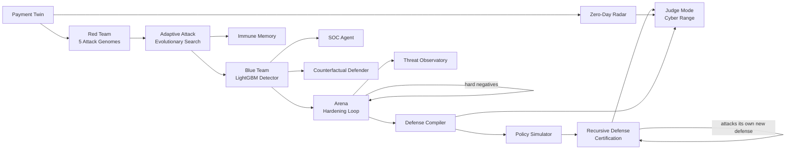

# SENTINEL-X
### Autonomous Adversarial Payment Defense

Sentinel-X is a synthetic payment twin in which an autonomous red team continuously
invents fraud attacks against its own defense, an autonomous blue team hardens
against every attack it discovers, and the system then **attacks its own new
defense again** — measuring, at every step, exactly how much residual risk is left.
Nothing here is a static rules engine or a one-shot trained classifier: it is a
closed loop of attack, detection, root-cause analysis, hardening, and
re-attack, with every number in the loop coming from a real, reproducible
computation over a synthetic dataset — never a fabricated demo value.

| | |
|---|---|
| **Backend** | FastAPI (Python 3.11+), Pydantic v2 |
| **ML** | LightGBM + scikit-learn, SHAP (`TreeExplainer`), NetworkX |
| **Frontend** | Next.js (App Router) + TypeScript + Tailwind + shadcn/ui + React Three Fiber |
| **LLM (structured-output only)** | Groq (`openai/gpt-oss-120b`) — never scores a transaction |
| **Tests** | 181 automated tests, `pytest` |
| **Data** | 100% synthetic — zero real cardholder or production payment data |

---

## The Core Idea

Traditional fraud detection is a single arrow:

```
ATTACK  →  DETECT
```

A model is trained once, deployed, and left to degrade as attackers adapt
around it. Sentinel-X closes the loop instead:

```
ATTACK → DETECT → ANALYZE → HARDEN → RE-ATTACK → MEASURE RESIDUAL RISK
                                          ↑                    |
                                          └────────────────────┘
```

The central engineering bet of this project is one sentence:

> **The defense is itself attacked.**

Every hardening step Sentinel-X produces — a retrained model, a compiled
defense policy, a new certified defense version — is not trusted on faith.
It is immediately targeted by the same evolutionary attack engine that found
the original weakness, and the system reports honestly whether the new
defense held, regressed, or produced no measurable improvement at all.

---

## 1. Problem Statement

Payment fraud is not static, and the tooling used to justify this project
treats it that way deliberately:

- **Synthetic identities** and **behavioral camouflage** are built to look
  statistically normal until the moment of extraction — a fixed rule
  threshold either catches them by luck or never does.
- **Social engineering / APP fraud** (the real-world analogue used here is
  UPI Collect Request-style scams) produces a transaction that is
  *structurally* completely normal — the attack lives entirely in coercive
  metadata a naive amount/velocity model never sees.
- **Synthetic voice/video impersonation** targets the human
  step-up-authentication layer, not the model at all.
- A detector trained once and left alone degrades silently as real
  attackers (or, here, an evolutionary search) discover the specific blind
  spots of that one frozen decision boundary.

Static rules struggle because they don't adapt. Static ML struggles because
"trained once, deployed forever" is exactly the failure mode a determined
adversary is optimizing against. The response Sentinel-X proposes is
**continuous adversarial validation**: never trust a defense you haven't
already tried to break yourself.

*(General motivation above is qualitative framing, not a measured project
result. Every specific number later in this document is a real, reproducible
value from this repository — see [Reproducing the Results](#16-reproducing-the-major-results).)*

---

## 2. What Sentinel-X Does



Every box above is a real, separately testable Python module in this
repository (see [Repository Map](#repository-map)). Nothing in this diagram
is aspirational — the "future work" items are called out explicitly in
[§19](#19-future-work).

---

## 3. Synthetic Payment Twin

`backend/app/simulator/clean_generator.py`

A fully synthetic, reproducible payment ecosystem, generated with fixed
NumPy/Faker seeds so every fresh clone produces byte-identical data:

- **10,000 customers**, **500 merchants**, **50,000+ transactions** over a
  30-day simulation window.
- Each customer has a persistent behavioral profile: income-tier-driven
  log-normal spend distribution, 1–2 primary devices, 3–10 usual merchants,
  2–6 usual beneficiaries, entity-persistence probability > 0.95 (a customer
  overwhelmingly keeps using the same devices/merchants/beneficiaries —
  novelty is the signal, not the norm).
- Diurnal timing (transactions cluster in daytime hours), realistic channel
  mix (POS/WEB/P2P), 10 merchant categories.
- **Fidelity-scored**, not asserted: `simulator/fidelity.py` computes a real
  KS-statistic / distribution-similarity report comparing generated data
  against the intended statistical targets, exposed via `POST /api/v1/simulate`.

All downstream generation (attacks, features, graph structure) sits on top
of this same synthetic twin — there is no real cardholder or production
payment data anywhere in this repository.

---

## 4. Feature Engineering & The LightGBM Detector

`backend/app/blue_team/features.py`, `graph_engine.py`, `detector.py`

Feature engineering is fully vectorized (no row-wise Python loops over a
DataFrame, by explicit project rule) and produces exactly 14 model inputs:

| Feature | What it captures |
|---|---|
| `amount` | Raw transaction amount |
| `count_5m` / `count_1h` / `count_24h` / `count_7d` | Rolling transaction-count velocity per customer |
| `sum_5m` / `sum_1h` / `sum_24h` / `sum_7d` | Rolling amount-sum velocity per customer |
| `amount_deviation_ratio` | `amount / (avg_amount_7d + 1e-6)` |
| `is_new_device` / `is_new_location` | Novelty flags against the customer's known profile |
| `shared_device_count` | Devices shared across distinct customers (train-graph) |
| `two_hop_fraud_risk` | Fraction of a customer's 2-hop network neighbors (shared device/beneficiary) with a fraud history in train |

Deliberately **excluded** from the model: `is_fraud` (target),
`genome_id`/`attack_family` (direct proxies for the label in this dataset),
raw merchant/channel identifiers (would let the model memorize a generation
artifact instead of learning behavioral signal), and
`is_new_beneficiary`/beneficiary-graph-degree (an explicit, documented
project decision — with only one un-mutated attack family available at
model-training time, routing to a brand-new mule beneficiary is a
near-deterministic tell that would erase the very evasion signal the Arena
is built to demonstrate).

**Detector**: `LightGBMClassifier` (`n_estimators=200`, `num_leaves=31`,
`learning_rate=0.05`, `is_unbalance=True`, `random_state=42`), trained on a
**customer-grouped, stratified train/test split** — every row for a given
customer goes entirely to one side, so the model can never see one
customer's behavior split across train and test. Graph features
(`shared_device_count`, `two_hop_fraud_risk`) are computed **train-only**
and then applied to both splits, so the graph itself cannot leak test
information into a feature.

**Decision thresholds** (single source of truth, not scattered magic
numbers):

```
[0.00, 0.35) → ALLOW
[0.35, 0.65) → STEP_UP
[0.65, 0.85) → REVIEW
[0.85, 1.00] → BLOCK
```

**Measured, reproducible with `seed=42`** (from `GET /api/v1/metrics`
against the live application — re-run it yourself, it will match): **F1 ≈
90.6%, precision ≈ 86.7%, recall ≈ 94.8%, FPR ≈ 1.7%**, on a held-out test
set of ~14,934 transactions. These are the actual numbers this repository
produces on a fresh run with the default seed — not illustrative figures.

### Explainability

`backend/app/blue_team/explainability.py`

Two complementary explanation types, both scoped honestly to transactions
already present in the cached train/test set (SHAP needs the *exact*
engineered feature row, which cannot be recomputed from a bare
`transaction_id` — a transaction generated fresh elsewhere gets an honest
404, not a fabricated explanation):

- **SHAP reason codes** (`GET /explain/{transaction_id}`) — top-3
  `TreeExplainer` local attributions, in the exact `{feature, contribution,
  description}` shape.
- **Counterfactual Defender** (`GET /explain/counterfactual/{transaction_id}`)
  — "what is the smallest realistic change that would have flipped this to
  ALLOW?" Samples 1,000 nearby points around the transaction's real feature
  vector, using **median-absolute-deviation-scaled** gaussian noise per
  feature (a raw standard deviation was tried first and produced nonsensical
  counterfactuals on heavy-tailed features like `amount_deviation_ratio` —
  MAD is robust to that), scores every sample with the real cached model,
  and reports the closest one that crosses the ALLOW threshold plus exactly
  which features would need to change and by how much. If none of the 1,000
  samples cross ALLOW, it says so honestly (`"no_nearby_allow_found"`) rather
  than fabricating a result.

---

## 5. Red Team — Five Attack Families

`backend/app/red_team/attack_genomes.py`, `attack_injector.py`

Every attack is represented as a **structured, Pydantic-validated Attack
Genome** — a JSON object with a canonical `genome_id`, `family`,
`parameters`, and `mutations` list. This is the mechanism that makes the
whole adversarial loop tractable: attacks are data, not ad-hoc code paths.

| # | Family | Genome ID | What it does |
|---|---|---|---|
| 1 | Agentic Micro-Structuring | `ATK-MS-001` | Splits a large amount into 10–15 smaller transactions across mule accounts to stay under single-transaction and velocity thresholds |
| 2 | Synthetic Identity Drift | `ATK-ID-001` | Behaves normally for ~20 days to build trust, then executes a sudden high-velocity extraction via a new device and new payee |
| 3 | Behavioral Camouflage | `ATK-BC-001` | Interleaves fraudulent transactions inside an authentic-looking spending burst |
| 4 | Social Engineering / Semantic Coercion | `ATK-SC-001` | A structurally normal transaction with adversarial memo metadata (urgency, impersonation) — the UPI Collect Request scam pattern |
| 5 | Synthetic Voice/Video Authorization | `ATK-VD-001` | Metadata-only simulation of a phone call impersonating a bank agent/executive/family member to bypass step-up verification — **no real audio/video is ever generated** |

### Constraint-aware mutations

Every mutation applied to a genome (`arena.py`'s `MUTATION_REGISTRY`) is
validated before acceptance: the mutated amount must stay within
`[0, customer.mean_spend × 20]`, the mutated timestamp sequence must remain
chronologically ordered per customer, and novelty flags
(`is_new_device`/`is_new_beneficiary`) must stay internally consistent with
whatever the mutation actually changed. This is a real, citable
differentiator: naive perturbation-based attack generation produces
physically impossible transactions; a constraint-validated mutation stays
realizable.

### Adaptive Evolutionary Search

`backend/app/red_team/adaptive_attack.py`

A genuine genetic algorithm over genomes, not a fixed attack list:

- **Fitness** = `0.5 × evasion_rate + 0.2 × novelty_score + 0.2 ×
  normalized_impact + 0.1 × realism_score − validity_penalty`.
- Each generation mutates the elite genomes from the previous generation,
  scores every candidate against the **real cached model**, and tracks a
  full lineage: every genome, its `parent_attack_id`, generation number,
  `is_elite`/`is_best` flags, and validity status.
- Instance IDs and mutated parameters are drawn from a **seeded** random
  stream, so the entire evolutionary run — including exactly which mutated
  genome_id appears in which generation — is reproducible given the same
  seed and configuration.

---

## 6. Arena — The Adversarial Hardening Loop

`backend/app/red_team/arena.py`

The MVP-gate loop that proves hardening actually works, end to end:

1. Run the un-mutated genome against the current model on a held-out
   population → **Initial Evasion Rate**.
2. Run it again on a **disjoint training-customer population**, harvest the
   transactions the model missed as **hard negatives**.
3. Retrain the detector on the original training data **plus** those hard
   negatives.
4. Re-test on a **matched population** — the *same* customers as the
   initial measurement, with genuinely fresh attack instances (different
   amounts/timestamps/mule IDs, a disjoint `instance_id` namespace via
   `generate_matched_population_attacks`) — never the literal rows that fed
   retraining → **Final Evasion Rate**.

```
Adversarial Robustness Gain (%) = ((Initial Evasion Rate − Final Evasion Rate) / Initial Evasion Rate) × 100
```

A documented, load-bearing design correction lives in this file's own
docstring: an earlier version measured initial and final evasion on
*different* random customer populations, which confounded "did retraining
help" with "which random customers got drawn" (a genuine ~2.2%→4.1% swing
was observed from population variance alone). The matched-population design
above exists specifically to isolate the retraining effect from that
confound — this is exactly the kind of leakage/confound risk a system that
grades its own homework has to actively design against, not assume away.

`run_multi_family_hardening` extends this to all 5 families at once,
harvesting hard negatives from every family into a single combined retrain,
then reporting each family's evasion rate against that one hardened model
(exposed via `POST /api/v1/arena/multi-family-run`).

---

## 7. Defense Compiler & Policy Simulator

`backend/app/blue_team/defense_compiler.py`, `policy_simulator.py`

Retraining is not the only defense mechanism. When the Arena or Judge Mode
finds a successful evasion, `analyze_attack` performs real root-cause
analysis (dominant SHAP-failure features, temporal/graph/novelty pattern
comparison between the base and evolved attack) and `compile_policy` turns
that into a structured `DefensePolicy` — an explicit, human-reviewable rule
(condition + action + severity), not another opaque model weight update.

`simulate_policy_utility` then estimates the policy's real effect: evasion
before/after, the honest FPR cost of adding the rule, and estimated fraud
loss prevented — computed from actual featured/graph-engineered clean and
attack populations and real `model.predict()` calls, not a hand-typed
number.

`CompositeDefenseAdapter` (`backend/app/defense/recursive_engine.py`) is the
piece that makes a compiled policy *and* the base model behave as one
composite defense for the purposes of the Arena/Recursive Defense loop: it
wraps M0 plus a list of accumulated `DefensePolicy` objects and exposes the
same `.predict()`/`.predict_proba()` interface the rest of the system
already expects — a genome doesn't need to know whether it's attacking a
raw model or a model-plus-policies stack.

---

## 8. Zero-Day Radar & Immune Memory

`backend/app/blue_team/zero_day.py`, `red_team/immune_memory.py`

**Zero-Day Radar** is an *unsupervised* companion to the supervised
detector: an Isolation-Forest-style novelty model trained on the real
held-out test set's engineered features, independent of the `is_fraud`
label. It clusters flagged "unknown" transactions and reports a real
novelty score and cluster count (`GET /defense/radar`) — this is the part
of the system that can, in principle, notice something the supervised
detector was never trained to recognize as fraud at all, since it isn't
looking for known fraud patterns in the first place.

**Immune Memory** is the system's accumulated record of every attack genome
discovered across every run this session — real `genome_id`, `attack_family`,
`initial_evasion`/`best_evasion`, `generation`, `parent_attack_id`,
`current_status` (`DISCOVERED`/`RETIRED`), and a `provenance` field that
explicitly distinguishes memory written during **training** hardening from
memory written during **evaluation-only** certification rounds — a
provenance boundary that exists specifically so evaluation-time discoveries
can never silently leak into what the model is retrained on.

---

## 9. Recursive Defense Certification Engine

`backend/app/defense/recursive_engine.py`, `schemas.py`

This is the project's sharpest idea: **the defense becomes the next attack
target.**

```
D0 (baseline LightGBM)
   ↓ attack
weakness found → compile policy
   ↓
D1 (D0 + policy)
   ↓ attack D1
weakness found (or NO NEW DEFENSE GENERATED, honestly)
   ↓
D2 (or certification stops here)
   ↓
CERTIFICATION RESULT
```

Each round runs the real evolutionary search against the *current*
composite defense (`CompositeDefenseAdapter`), analyzes the failure,
compiles a policy if evasion is meaningful (>5%), and produces the next
defense version — genuinely recursive, not a fixed two-step demo.

**Data-integrity guarantees, enforced in code, not just asserted in
comments:**

- **Customer-level leakage** is checked with a hard `raise RuntimeError` if
  any customer appears in both the train and evaluation populations —
  certification cannot silently proceed past this.
- **Row-level leakage** — every attack transaction generated during
  certification is checked for `transaction_id` collisions against
  `train_df`/`test_df` and against every earlier round's evolved-attack
  batch, using `generate_matched_population_attacks`'s disjoint
  `instance_id` offset mechanism (the same one the Arena uses). This
  replaced an earlier version of the code where `row_leakage` was an
  unconditional literal `0` — a real, previously undetectable bug that
  building this real check surfaced and fixed.
- **F1/FPR regression gates** — the certification fails
  (`certification_status: "FAILED"`) rather than reporting success if the
  final F1 regresses by more than 2% or clean FPR increases by more than 1%
  versus the baseline, computed from real `evaluate_detector` calls on the
  original held-out test set.
- **`NO_NEW_DEFENSE_GENERATED`** is a real, honest terminal state — if the
  evolved attack's evasion doesn't clear the 5% bar, the engine reports
  exactly that instead of inventing a policy to fill the response shape.

Exposed via `POST /api/v1/defense/certify`, visualized in the frontend by
`RecursiveDefenseGraph.tsx` — a real node-link diagram over the actual
`DefenseRound` sequence returned by the API, never a fabricated D2.

---

## 10. Judge Mode — The Fraud Cyber Range

`backend/app/judge/`, frontend `app/judge/page.tsx`

An 11-phase, single-command orchestration of nearly the entire system, built
specifically so a judge can watch the whole story unfold in one run:

```
PREPARE → ATTACK → DETECT → ADAPT → DISCOVER → ANALYZE → DEFEND → SIMULATE → APPROVE → REPLAY → SCORE
```

Each phase calls existing, already-independently-tested service functions
(never reimplements them): attack injection, adaptive evolutionary search,
Zero-Day Radar, `analyze_attack`/`compile_policy`, `simulate_policy_utility`,
and an optional human-approval gate before the final replay/score. The
closing `Scorecard` reports initial/best-evolved/final evasion, robustness
gain, F1/FPR, unknown-detection rate and cluster count, policy status, and
an honest `evasion_note` when peak evolved evasion turns out to be
genuinely indistinguishable from the baseline (a real "robust defense"
finding, not something the display quietly papers over).

---

## 11. Autonomous SOC Agent

`backend/app/blue_team/soc_agent.py`

A structured investigation layer built on the same architectural
non-negotiable as everywhere else in this project: **the LLM never scores a
transaction or makes the ALLOW/BLOCK decision.** It receives real SHAP
evidence for a real cached transaction plus a real Immune Memory summary,
and is forced (via Groq tool-calling, not free-form JSON — an earlier
`response_format=json_object` approach was tested and found to
occasionally collapse structured ranges into scalars) to return a
structured verdict: hypothesis, suspected attack family, confidence,
exactly 3 evidence points, recommended action, reasoning chain, and a
formal audit-log line. A malformed or invalid response gets exactly one
retry before the endpoint fails honestly — never a silently coerced
verdict. Exposed via `POST /api/v1/soc/investigate/{transaction_id}`.

---

## 12. Threat Observatory

`backend/app/api/endpoints.py` (`/observatory/*`), frontend `app/observatory/`

Three real, API-backed views over the adaptive search's own output:

- **Fraud DNA Evolution Tree** — the full lineage from the most recent
  adaptive search, rendered as a real parent→child node graph
  (`@xyflow/react`): base genome, elite branches (amber), the single best
  variant (green, high-emphasis), and invalid mutations, all using real
  `parent_attack_id`/`is_elite`/`is_best`/`validity_status` fields.
- **Economic Impact** — total attack value, value caught by the baseline
  model, value caught after hardening, and the resulting incremental value
  prevented, computed from real attack-transaction amounts and real
  before/after `model.predict()` outcomes — always labeled explicitly as
  *"a synthetic benchmark measurement... not a production financial-loss
  estimate."*
- **STIX 2.1 Export** — a real, spec-shaped `bundle`/`attack-pattern`
  object built as a plain Python dict (no new dependency), with
  deterministic hash-derived IDs so exporting the same genome from the same
  run twice produces byte-identical output.

---

## 13. What Makes Sentinel-X Different

- The LLM never touches a fraud score. Every ALLOW/STEP_UP/REVIEW/BLOCK
  decision is deterministic, auditable LightGBM + engineered features —
  the LLM only ever produces structured genome JSON or narrated evidence
  over evidence it's given.
- Mutations are constraint-validated against realistic bounds, not naive
  perturbations that would produce physically impossible transactions.
- The evaluation methodology actively defends against its own
  self-grading risk: matched populations to isolate the retraining effect
  from customer-sampling variance, customer- and row-level leakage checks
  enforced with hard runtime assertions (not just documentation), and
  regression gates that can and do fail a certification.
- The system doesn't just harden once — it re-attacks its own new defense
  and reports `NO_NEW_DEFENSE_GENERATED` honestly when nothing further is
  found, rather than fabricating a second win.

---

## 14. What Is Actually Implemented Today

Everything described in §3–§12 above is real, working code in this
repository, exercised by the 181-test automated suite (see
[§16](#16-reproducing-the-major-results)). Nothing in those sections is
aspirational.

What is explicitly **not** implemented (see [§19](#19-future-work) for the
full list): a persistence layer for arbitrary evolved-genome lookups by ID
(`/defense/analyze-attack` is an honest `501` stub for this reason), a
database/queue-backed multi-user deployment, real voice/video generation
(deliberately out of scope — this attack family is metadata-only by
design, not an unfinished feature), and dependency-version pinning in
`requirements.txt` (currently unpinned — a known reproducibility risk, not
yet fixed).

---

## 15. Repository Map

```
MasterCard_AI_project_/
├── backend/
│   ├── app/
│   │   ├── main.py                  # FastAPI entrypoint, CORS, lifespan startup
│   │   ├── core/
│   │   │   ├── config.py            # Seeds, dataset scale, decision-threshold source values
│   │   │   └── schemas.py           # Canonical Pydantic I/O models
│   │   ├── simulator/               # Payment Twin generation + fidelity scoring
│   │   ├── red_team/                # Attack genomes, injector, Arena, adaptive search, immune memory
│   │   ├── blue_team/               # Features, graph engine, detector, explainability, zero-day, defense compiler, policy simulator, SOC agent
│   │   ├── defense/                 # Recursive Defense Certification Engine
│   │   ├── judge/                   # Judge Mode orchestration
│   │   └── api/                     # FastAPI routes (endpoints.py)
│   ├── requirements.txt
│   └── tests/                       # 181 tests, one file per subsystem
└── frontend/
    └── src/
        ├── app/                     # Next.js routes: /, /red-team, /payment-twin,
        │                            #   /blue-team-soc, /arena, /judge, /observatory, /threat-map
        ├── components/              # Shared UI (shell/, three-d/, ArenaView, BlueTeamSOC, ShapModal, RecursiveDefenseGraph, ...)
        └── lib/api.ts                # Typed API client
```

---

## 16. Reproducing the Major Results

```bash
# Backend
cd backend
pip install -r requirements.txt
PYTHONPATH=. uvicorn app.main:app --host 0.0.0.0 --port 8000
# First request after startup may take 30-60s: the full synthetic twin
# and LightGBM model are generated/trained fresh on every process start
# (no persisted model artifact). Requests before that return an honest 503.

# In a second terminal, once ready:
curl http://127.0.0.1:8000/api/v1/metrics
# Real, reproducible output with the default seed=42:
# {"precision":0.867,"recall":0.948,"f1":0.906,"pr_auc":0.965,"fpr":0.017,"test_set_size":14934,...}

curl -X POST http://127.0.0.1:8000/api/v1/arena/run \
  -H "Content-Type: application/json" -d '{"genome_id":"ATK-MS-001","n_instances":100}'
# Real initial/final evasion rate and robustness gain for this run.
```

```bash
# Frontend
cd frontend
npm install
npm run dev
# open http://localhost:3000
```

```bash
# Full automated test suite (181 tests; several train a real LightGBM
# model per test file, so this takes ~15-30 minutes, not seconds)
cd backend
PYTHONPATH=. python3 -m pytest tests/ -q
```

Every number this README cites in §4 was produced by literally running the
commands above against this repository, not copied from a slide.

---

## 17. Deployment

The intended architecture is deliberately simple for a hackathon-scale
free-tier deployment:

```
Vercel (frontend, Next.js)  →  HTTPS  →  Render (backend, FastAPI, free web service)
```

- **Backend (Render)**: Root directory `backend`, build `pip install -r
  requirements.txt`, start `uvicorn app.main:app --host 0.0.0.0 --port
  $PORT`. `initialize_app_state()` runs in a background thread
  (`loop.run_in_executor`) specifically so the port binds immediately —
  Render's free-tier port scanner has a shorter timeout than the
  synchronous dataset-generation-plus-training startup this app used to
  block on, and that mismatch was a real, diagnosed production incident
  during this project's own deployment (fixed by moving initialization off
  the event loop, not by faking readiness).
- **Frontend (Vercel)**: Root directory `frontend`, environment variable
  `NEXT_PUBLIC_API_BASE_URL` pointed at the deployed Render URL (already a
  supported, existing mechanism in `lib/api.ts` — not added as a deployment
  afterthought).
- **CORS**: the backend's allowed-origins list is extended by one optional
  `FRONTEND_ORIGIN` environment variable, defaulting to local-dev-only
  behavior when unset — never a wildcard.
- **Secrets**: exactly one — `GROQ_API_KEY` — loaded server-side only via
  `python-dotenv`, never exposed to the frontend bundle, never placed in a
  `NEXT_PUBLIC_*` variable.

---

## 18. Limitations

Stated plainly, not hidden in a footnote:

- **Synthetic data only.** Every number in this document describes
  behavior on a synthetic twin. No claim is made, implied, or should be
  inferred about performance on real production payment data.
- **Single-process, in-memory state.** `_APP_STATE` and the various
  "latest run" caches are process-global. Concurrent requests are
  individually correct, but a second concurrent run can overwrite what an
  unrelated earlier caller is still reading from a shared cache — an
  accepted, disclosed limitation of a single-instance hackathon
  deployment, not a hidden bug.
- **Voice/video authorization is metadata-only** by explicit design — no
  real audio or video is generated or analyzed anywhere in this system.
- **`requirements.txt` is unpinned.** A fresh install could in principle
  resolve different dependency versions than the ones this repository was
  developed and tested against.
- **`/defense/analyze-attack` is an honest `501`** — it requires a
  persistence layer for arbitrary evolved-genome-to-transactions lookup by
  ID that does not yet exist, rather than reimplementing the logic
  narrowly just to return *something*.
- Model latency, memory footprint under real concurrent load, and
  dependency-pinned reproducibility across environments are **not
  currently measured** in this repository.

---

## 19. Future Work

Named explicitly here so it is never confused with what's already built:

- Persisted, queryable storage for arbitrary past evolved genomes (unblocks
  `/defense/analyze-attack` for any historical run, not just the most
  recent one).
- Dependency-version pinning for reproducible builds.
- Multi-instance/shared-state deployment (a real database or cache layer,
  only if a genuine multi-user scaling need is proven — not added
  speculatively).
- A 6th attack family, additional LLM providers, reinforcement-learning-based
  attack search, GNN-based graph features, and a production-grade feature
  store are all explicitly **out of scope for this submission** and named
  only as possible production-scale-up directions, not partially-built
  features.

---

*Sentinel-X was built for the Mastercard Innovation Challenge @ GFF 2026,
"AI Defense Lab for Payment Security." All data is synthetic; no real
cardholder or production payment data is used anywhere in this repository.*
